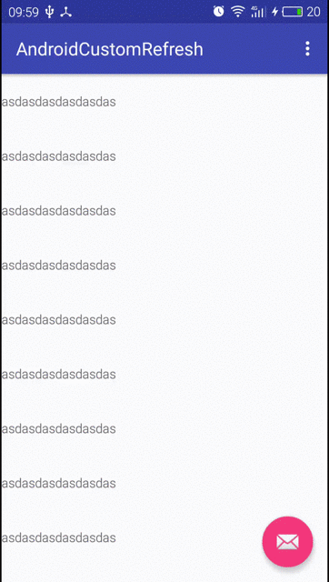

# AndroidCustomRefresh 
*** 
 
Android custom refresh layout for ``listview`` and ``recyclerview`` 

 

# Usage 
*** 

In XML
    
    <com.wzq.customrefresh.CustomRefreshLayout
        android:layout_width="match_parent"
        android:layout_height="match_parent"
        android:id="@+id/custom_refresh">

        <android.support.v7.widget.RecyclerView
            android:id="@+id/recycler"
            android:layout_width="match_parent"
            android:layout_height="match_parent">

        </android.support.v7.widget.RecyclerView>
    </com.wzq.customrefresh.CustomRefreshLayout> 
    
Attrs 
    
     <declare-styleable name="CustomRefreshLayout">
            <attr name="AnimBackColor" format="color" />
            <attr name="AnimSwipeColor" format="color" />
            <attr name="AnimCircleColor" format="color"/>
            <attr name="AnimRadius" format="integer"/>
            <attr name="AnimTextSize" format="integer"/>
            <attr name="AnimTextColor" format="color"/>
     </declare-styleable>
        
